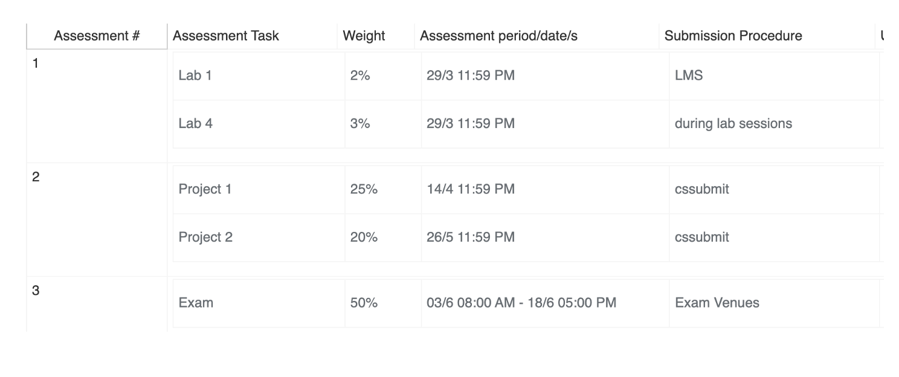
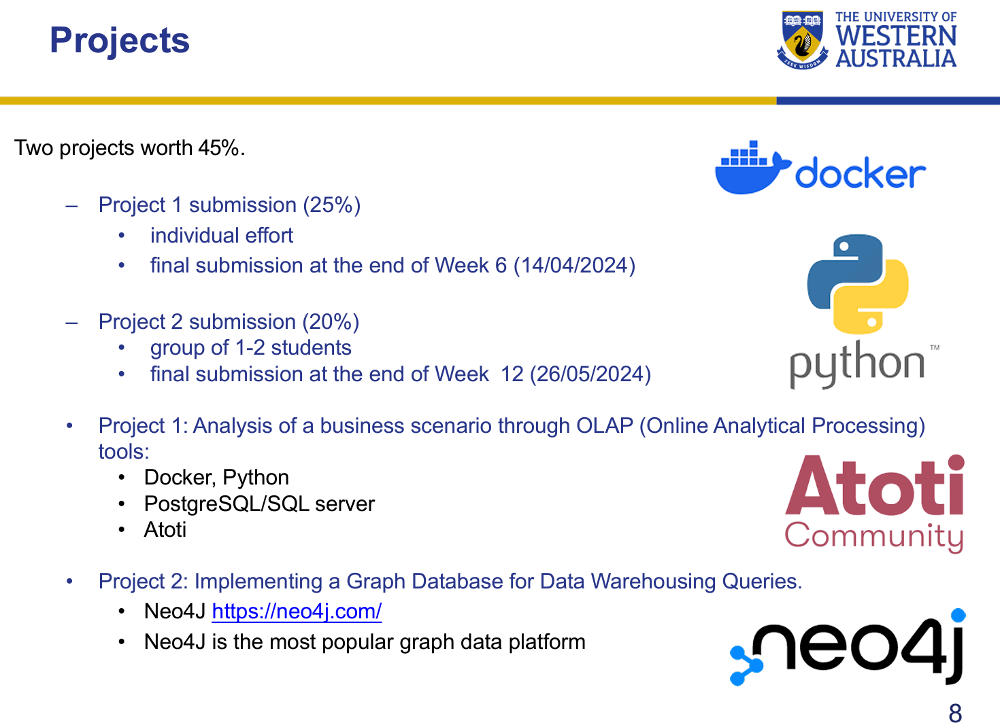

### Important Dates
- 

### Notes
- [ ] 1 lecture and 1 lab in a week
- [ ] Do labs before you attend lab
- [ ] Check discussion on teams
- [ ] The repo has been updated. If stuck, redo the whole thing updated last Thursday

### Labs: 
- One Server is ok. Don't have to use both SQL Server and Postgres SQL Server

### Assessment

### Projects

  
