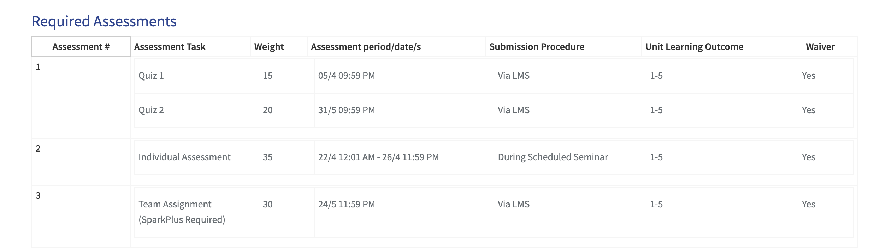

### Classes
- 1 lecture and 1 seminar in a week

### Important Dates: 
- [ ] Check with other members to make sure date matches

### Public Holiday Make-Up Classes
- Since, i am going on Tuesday, it's not affected

### Notes
- No exams
- [ ] Lookout for announcements for online quizzes
- [ ] Create list of the SQL commands and Queries : Can use SQL blocks for syntax highlight

### Assessments
This unit will contain three assessments: \
    1. **Online quizzes** (two of which are held throughout semester): you will have a twelve (12) hour window to complete a few short answer questions; \
    2. **Individual assessment:** this will cover the database topics that we cover throughout semester and be conducted during the lecture, held in seminars during Week 8; \
    3. **Team assignment:** this will be due in the final week (Week 12) and will primarily focus on the BI tools content. More details will be provided closer to the time

